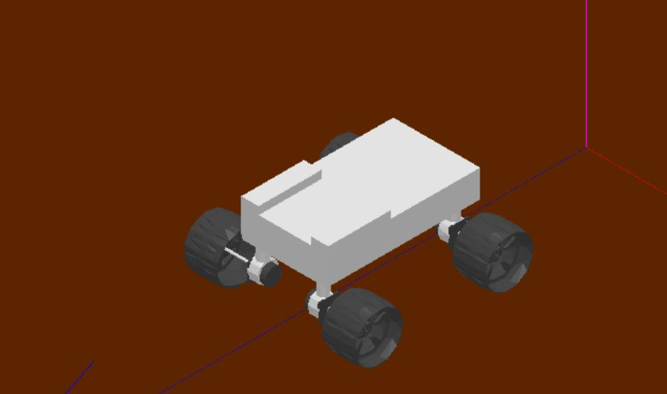

# Mars Rover Simulation and Control

## Description
* Simulated the motion of a Rover on the surface of Mars using a multibody Approach.
* Designed a Proportional Integral (PI) controller to control the motion of the Mars Rover.

## Dependencies
* [EasyDyn Installation and Steps](https://www.youtube.com/watch?v=UBJsEpGhe54&list=PLHqhOPWK5Yj9mU4LEKnrzOPH6ZNaJ5KxG) 

## Usage
* Open and Run the Rover.cpp file
* Use EasyAnim to View the animation or to view the mode shapes.
* Use GnuPlot to view the motion plots and their derivatives 

Note: Do not run the python file, it will erase important information in the c++ file.
The python file is just used to generate the kinematics

## Author
* Jonas Chianu